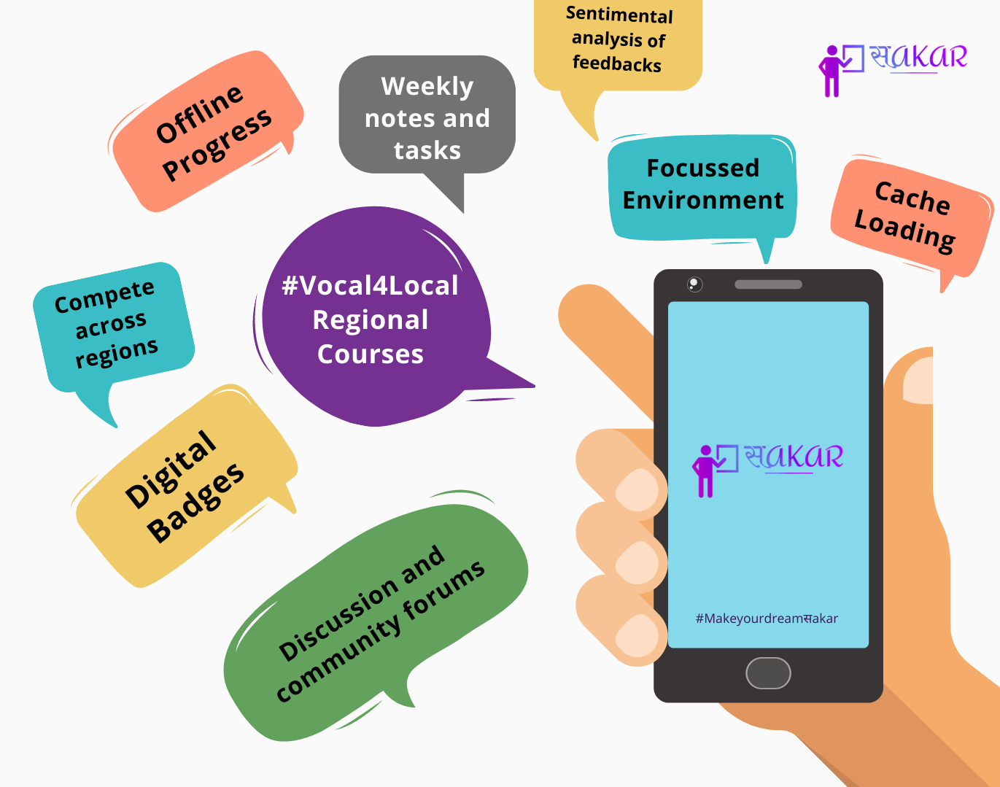

<!--
*** Thanks for checking out this README Template. If you have a suggestion that would
*** make this better, please fork the repo and create a pull request or simply open
*** an issue with the tag "enhancement".
*** Thanks again! Now go create something AMAZING! :D
-->


<!-- PROJECT SHIELDS -->
<!--
*** I'm using markdown "reference style" links for readability.
*** Reference links are enclosed in brackets [ ] instead of parentheses ( ).
*** See the bottom of this document for the declaration of the reference variables
*** for contributors-url, forks-url, etc. This is an optional, concise syntax you may use.
*** https://www.markdownguide.org/basic-syntax/#reference-style-links
-->


# GHCI20 Codeathon
## Team-HobbyHacks


<!-- PROJECT LOGO -->
<br />
<p align="center">
  <a href="https://github.com/SabhyaGrover/sakar-ghci" >
    
  </a>

  <h1 align="center">सakar</h1>

  <p align="center">
  <b>#MakeYourDreamSakar</b>
    <br />
    <a href="https://github.com/SabhyaGrover/sakar-ghci">View Demo</a>
    .
    <a href="https://github.com/SabhyaGrover/sakar-ghci/issues">Report Bug</a>
    ·
    <a href="https://github.com/SabhyaGrover/sakar-ghci/issues">Request Feature</a>
  </p>
</p>


<!-- TABLE OF CONTENTS -->
## Table of Contents

* [About the Project](#about-the-project)
  * [Built With](#built-with)
* [Getting Started](#getting-started)
  * [Prerequisites](#prerequisites)
  * [Installation](#installation)
* [Contributing](#contributing)
* [License](#license)


<!-- ABOUT THE PROJECT -->
## About The Project

SAKAR is a platform where students can have distraction free learning. As we call it, it is "NETFLIX for LEARNERS". Due to COVID, when offline learning got hindered, E-learning
came to the fore-front. There are various resources available on the web but there is no common platform that connects all the educational content without any diversions. SAKAR is the straight road to learning that every learner needs.
<p align="center">
 
</p>

### Built With

- **Frontend**: [React-Native](https://reactnative.dev/) and [Expo](https://expo.io/)
- **Backend**: [Firebase](https://firebase.google.com/)
- **IDE**: VS Code
- **Design**: Figma, Whimsical
- **Version Control**: Git and GitHub


<!-- GETTING STARTED -->
## Getting Started

### Prerequisites

This is an example of how to list things you need to use the software and how to install them.
* npm
```sh
npm install npm@latest -g
```

### Installation


1. Clone the repo
```sh
git clone https://github.com/SabhyaGrover/sakar-ghci.git
```
2. Install NPM packages
```sh
npm install -g expo-cli
```
```sh
npm i
```
3. Get your YouTube API key [here](https://developers.google.com/youtube/v3/getting-started). Replace **`API_KEY=XXXXXXXXXX`** with your own YouTube API key.

```sh

const API_KEY = 'XXXXXXXXXXXX'; // REPLACE IT WITH YOUR YOUTUBE API KEY

```
4. Start the expo
```sh
npm start
```
5. Download Expo Application from PlayStore.

6. Scan the QR Code to run the App on your phone.

## Team:


| S.No. | Team Member Name | Role | GitHub Username |
| --------------- | --------------- | --------------- | --------------- |
| 1. | Sabhya Grover | Backend Development | [@SabhyaGrover](https://github.com/SabhyaGrover) |
| 2. | Chanchal Bansal | Frontend Developer| [@Chanchal1603](https://github.com/Chanchal1603)  |
| 3. | Shalini Kumari | UI Designer/Frontend Developer | [@shalinikumari50](https://github.com/shalinikumari50)  |


<!-- CONTRIBUTING -->
## Contributing

Contributions are what make the open source community such an amazing place to be learn, inspire, and create. Any contributions you make are **greatly appreciated**.

1. Fork the Project
2. Create your Feature Branch (`git checkout -b feature/AmazingFeature`)
3. Commit your Changes (`git commit -m 'Add some AmazingFeature'`)
4. Push to the Branch (`git push origin feature/AmazingFeature`)
5. Open a Pull Request


<!-- LICENSE -->
## License

Distributed under the MIT License. See `LICENSE` for more information.

## Show your support

Give a ⭐️ if this project helped you!

